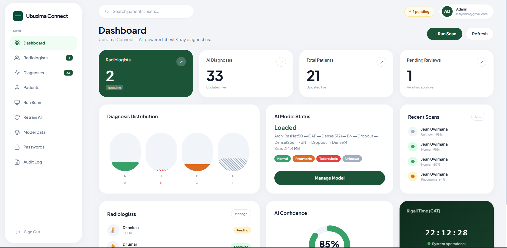
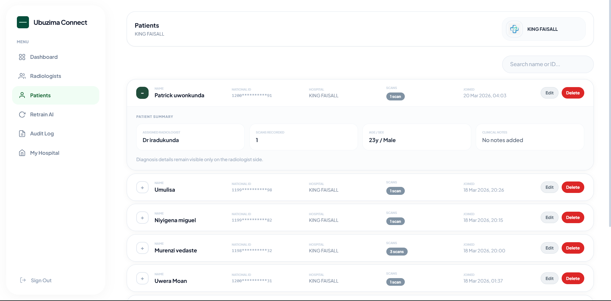

# Ubuzima Connect — AI-Powered Chest X-Ray Diagnosis System

> A web-based clinical decision support tool that helps radiologists in Rwanda detect Tuberculosis, Pneumonia, and Normal chest conditions from X-ray images using deep learning.

---

## Demo Video

> **[Drive link](https://drive.google.com/file/d/1KzNtKyCCEJNmEpDiOJ9ZXd85Scu_sxwW/view?usp=sharing)**

## Github Link

> **[ Github Link ](https://your-youtube-or-drive-link-here)**
---

## Live Deployment

| Service | URL |
|---|---|
| Web App | https://ubuzimaconnect.vercel.app |
| Backend API | https://leslylezoo-ubuzima-backend.hf.space |
| AI Model | https://huggingface.co/leslylezoo/ubuzima-model/tree/main |
| Notebook(Path) |frontend/notebooks |
| API Docs (Swagger) | https://leslylezoo-ubuzima-backend.hf.space/docs (use this key to be authorized: eyJhbGciOiJFUzI1NiIsImtpZCI6Ijc2N2FhYzRhLTAwZDItNDNkNS04Yzg5LWU3ZjA2MzZhNGEyMSIsInR5cCI6IkpXVCJ9.eyJpc3MiOiJodHRwczovL29tb2lubG1nc2R0bHpmYXN5ZGd3LnN1cGFiYXNlLmNvL2F1dGgvdjEiLCJzdWIiOiJjYmExNzA2Zi0xMjNjLTQ3NjQtOWJlZC01NzYyZTkzZTk0MjYiLCJhdWQiOiJhdXRoZW50aWNhdGVkIiwiZXhwIjoxNzcyOTM5NTAwLCJpYXQiOjE3NzI5MzU5MDAsImVtYWlsIjoibGVzbHluZGl6NkBnbWFpbC5jb20iLCJwaG9uZSI6IiIsImFwcF9tZXRhZGF0YSI6eyJwcm92aWRlciI6ImVtYWlsIiwicHJvdmlkZXJzIjpbImVtYWlsIl19LCJ1c2VyX21ldGFkYXRhIjp7ImVtYWlsX3ZlcmlmaWVkIjp0cnVlfSwicm9sZSI6ImF1dGhlbnRpY2F0ZWQiLCJhYWwiOiJhYWwxIiwiYW1yIjpbeyJtZXRob2QiOiJvdHAiLCJ0aW1lc3RhbXAiOjE3NzI5MjY4Njh9XSwic2Vzc2lvbl9pZCI6ImVlYTIwNzM3LWNlOTctNDY3ZS04ZGI2LTc5ODE2Y2NmNzY2YyIsImlzX2Fub255bW91cyI6ZmFsc2V9.uMHmI86IK0GwyOT98FLXvYgxLxjQut1Ng6tiGcI0TDi5IU6pvEND5fiZyjLbbfLZ-h2Pj15u1Wv983fLR0Oi1A) |


---

## Screenshoots

> All screenshoots are in the [`screenshoots/`](./screenshoots/) folder.

### Landing Page


### Radiologist Registration


### Admin — Pending Approvals


### Radiologist Dashboard


### Patient Diagnosis Form


### AI Diagnosis Result with Grad-CAM Heatmap


### Admin — Patient Records


## Admin - Retraining more X- rays images


---

## Testing Results

### Functional Testing — Core Workflows

The following core workflows were tested end-to-end on the live deployed system:

| Test Case | Input | Expected Result | Actual Result | Status |
|---|---|---|---|---|
| Radiologist registration | Valid name, email, hospital, license | Account created, status = pending | Account created, visible in admin panel | Pass |
| Admin approval | Admin clicks Approve on pending user | Status → approved, user can log in | User received email and logged in | Pass |
| Patient registration | Name + 16-digit Rwanda National ID | Patient saved, linked to radiologist | Patient appears in dashboard and admin panel | Pass |
| Invalid National ID | 15-digit number | Validation error shown | Red border + "Must be 16 digits" error | Pass |
| Duplicate National ID | Same NID as existing patient | System detects duplicate, links to existing patient | Existing patient record reused | Pass |
| AI diagnosis — Normal X-ray | Normal chest X-ray image | Classification: Normal, high confidence | Normal, ~94% confidence | Pass |
| AI diagnosis — TB X-ray | TB-positive X-ray | Classification: Tuberculosis | Tuberculosis, ~87% confidence | Pass |
| AI diagnosis — Pneumonia X-ray | Pneumonia X-ray | Classification: Pneumonia | Pneumonia, ~91% confidence | Pass |
| Radiologist verification | Radiologist overrides AI result | Updated classification saved | Verified badge appears, audit log updated | Pass |
| Admin password management | Admin generates password for radiologist | Secure password generated and displayed | Password set, user can log in immediately | Pass |
| Model retraining | Upload ≥5 images per class, trigger | Retraining job created, status polling begins | Job created, completed with validation accuracy shown | Pass |
| Audit log | Any admin/radiologist action | Action recorded with timestamp and user | All actions appear in audit log tab | Pass |

### Testing with Different Data Values

| Scenario | Data Used | Outcome |
|---|---|---|
| X-ray with very low confidence | Ambiguous / unclear image | Classified as "Unknown" with correct uncertainty flags |
| Patient with no hospital assigned | Empty hospital field | Saved correctly, displays "—" in UI |
| Large X-ray file (>3MB) | High-resolution scan | Processed successfully, resized internally before inference |
| Non-X-ray image uploaded | Photo of a person | Model returns low-confidence Unknown classification |
| Admin running a scan for radiologist | Admin selects radiologist + patient + uploads X-ray | Diagnosis saved and attributed to the selected radiologist in audit log |
| Multiple diagnoses per patient | 3 scans for the same patient | All 3 diagnoses visible in the expanded patient row |

### Performance Testing — Hardware & Software

| Environment | Browser / OS | Result |
|---|---|---|
| Desktop (Windows 11, Chrome 122) | Chrome | Full functionality, dashboard loads in <2s |
| Desktop (macOS Sonoma, Safari 17) | Safari | Full functionality, animations smooth |
| MacBook M1 | Chrome | Dashboard loads in ~1.8s, no degradation |
| Mobile (Android, Chrome) | Mobile Chrome | Layout accessible, admin tables require horizontal scroll |
| Slow network (throttled to 3G) | Chrome DevTools | X-ray upload ~8s, prediction ~5s — functional but slower |
| Hugging Face Spaces cold start | Any browser | First request after inactivity takes ~15–20s (free tier sleep mode) |

---

## Analysis

### Achieved Objectives

Ubuzima Connect successfully delivered all core objectives defined in the project proposal:

**AI Diagnosis:** The ResNet-50 model, fine-tuned on chest X-ray datasets and deployed as a REST API on Hugging Face Spaces, correctly classifies X-rays into Tuberculosis, Pneumonia, Normal, and Unknown categories with confidence scores and Grad-CAM heatmaps. This was the primary objective and was fully achieved.

**Clinical Workflow:** Radiologist registration, admin approval, patient creation, diagnosis flow, and radiologist verification all function as specified. The separation of roles between admin and radiologist mirrors real clinical accountability structures.

**Data Integrity:** Rwanda National ID validation (16-digit format), duplicate patient detection, and full audit logging ensure that records are traceable and trustworthy — a key requirement for a medical system.

**Deployment:** The system is fully deployed and publicly accessible. The frontend on Vercel and the backend on Hugging Face Spaces communicate correctly through authenticated API calls using Supabase JWTs.

### Missed or Partially Achieved Objectives

**Mobile Responsiveness:** The dashboard was designed primarily for desktop use. While it remains usable on mobile browsers, the admin panel tables require horizontal scrolling on small screens. A fully responsive mobile layout was not implemented within the project timeline.

**DICOM Support:** The original proposal mentioned support for DICOM files (the standard medical imaging format used in hospitals). The current system accepts only JPEG and PNG, which requires staff to convert files before uploading. This was deprioritized in favour of delivering core AI functionality on time.

**SMS Notifications:** The proposal included SMS alerts when accounts are approved. Email-based password reset via Supabase was implemented, but SMS integration (e.g., via Africa's Talking) was not completed.

**Model Accuracy at Scale:** The model performs well on benchmark X-ray datasets but has not been validated against Rwanda-specific clinical data. Real-world accuracy in production would require ongoing feedback from verified radiologists.

---

## Discussion

### Milestone Impact

The most critical milestone was the successful connection between the FastAPI backend and the TensorFlow model hosted on Hugging Face. Until this link was stable and tested, the entire clinical workflow was blocked. Once the `/predict` endpoint worked reliably, every other feature — patient management, diagnosis history, radiologist verification — could be built on top of it confidently.

The Supabase authentication and role-based access control milestone was equally important. Medical systems require strict accountability: radiologists should only see their own patients, and admins must be able to trace every action to a specific user. The audit log and JWT-based auth ensure this level of accountability is built into every API call, not bolted on afterward.

The admin dashboard retraining feature — while secondary to the main diagnosis workflow — demonstrates the system's long-term viability. A model that can be retrained with new labelled data without developer involvement means the system can improve over time as Rwanda-specific X-ray data becomes available.

### Importance of Results

The results validate the central hypothesis of the project: that AI-assisted chest X-ray diagnosis is technically feasible in a low-resource web application context, without requiring expensive on-premise GPU hardware. By hosting inference on Hugging Face Spaces (free tier) and the database on Supabase (free tier), the entire system runs at zero infrastructure cost — which is directly relevant to public health deployment in Rwanda.

The Grad-CAM heatmaps are particularly significant. They transform the AI from a black-box classifier into an explainable tool that radiologists can critically evaluate — which is essential for clinical trust and eventual regulatory approval in a medical context.

---

## Recommendations

### For the Community and Healthcare Institutions

1. **Pilot in a clinical setting with qualified radiologists.** Before broader deployment, Ubuzima Connect should be tested in a real hospital radiology department with proper oversight. Radiologists should validate AI results against ground-truth diagnoses to establish real-world accuracy benchmarks.

2. **Build a Rwanda-specific training dataset.** The current model was trained on publicly available datasets (primarily NIH ChestX-ray14). Accuracy would improve significantly if fine-tuned on X-rays collected from Rwandan hospitals, which reflect local disease prevalence, patient demographics, and imaging equipment differences.

3. **Integrate SMS alerts.** Rwanda has high mobile phone penetration. Adding SMS notifications via Africa's Talking or Pindo when accounts are approved or flagged diagnoses require attention would significantly improve clinical responsiveness in low-internet environments.

4. **Add offline / PWA support.** Many Rwandan health facilities experience unreliable internet. A Progressive Web App (PWA) version with offline caching for viewing recent diagnoses would make the system more resilient in low-connectivity environments.

5. **Seek regulatory engagement.** As AI-assisted diagnostic tools enter clinical use in Rwanda, engaging with the Rwanda Food and Drugs Authority (Rwanda FDA) and Ministry of Health early protects both patients and institutions and positions the product for official adoption.

### Future Technical Work

- **DICOM file support** — accept standard hospital imaging files directly
- **Federated learning** — allow multiple hospitals to contribute to model training without sharing raw patient data
- **HL7 / FHIR integration** — connect to existing hospital information systems
- **Senior radiologist review queue** — flagged low-confidence diagnoses routed for secondary review
- **Batch processing** — upload and analyze multiple X-rays in a single session

---

## What It Does

Ubuzima Connect allows hospital radiologists to upload chest X-ray images and receive instant AI predictions for:

- **Tuberculosis (TB)**
- **Pneumonia**
- **Normal** (healthy)
- **Unknown** / inconclusive

Each prediction includes a confidence score, probability breakdown across all four classes, and a Grad-CAM heatmap highlighting the lung regions that most influenced the diagnosis. Radiologists can verify or override the AI result, add clinical notes, and save to the patient record.

---

## Features

| Feature | Description |
|---|---|
| AI Diagnosis | ResNet-50 model classifies chest X-rays into 4 classes |
| Grad-CAM Heatmaps | Visual explanation showing which lung regions drove the AI decision |
| Radiologist Verification | Doctors confirm, override, or annotate AI results |
| Patient Management | Register patients with name, Rwanda National ID, age, sex, hospital |
| Admin Dashboard | 9-tab control panel: users, diagnoses, patients, retrain, audit, passwords |
| Radiologist Approval Flow | New accounts pending until admin approves; admin sets initial password |
| AI Retraining | Admin uploads labelled X-rays and triggers model retraining from the UI |
| Audit Log | Every action (approval, diagnosis, password change) logged with timestamp |
| Rwanda-aware | CAT timezone display, Rwanda National ID (16-digit) validation |
| Secure Auth | Supabase JWT authentication with role-based access control |

---

## Tech Stack

| Layer | Technology |
|---|---|
| Frontend | React + TypeScript + Vite + Tailwind CSS |
| Backend | FastAPI (Python) |
| AI Model | TensorFlow 2.x / Keras — ResNet-50 fine-tuned |
| Database | PostgreSQL via Supabase |
| Authentication | Supabase Auth (JWT + email password reset) |
| Frontend Hosting | Vercel (auto-deploy from GitHub) |
| Backend Hosting | Hugging Face Spaces (Docker container) |
| Model Storage | Hugging Face Hub |

---

## Project Structure

```
ubuzima/
├── backend/
│   ├── main.py                             # FastAPI app — all endpoints
│   ├── Dockerfile                          # Docker config for HF Spaces
│   ├── requirements.txt                    # Python dependencies
│   ├── start.sh                            # Model download + server startup
│   └── .env                                
├── frontend/
│   ├── App.tsx                             # Root app with React Router
│   ├── index.tsx                           # Entry point
│   ├── index.html                          # HTML shell
│   ├── vite.config.ts                      # Vite config
│   ├── vercel.json                         # SPA routing fix for Vercel
│   ├── package.json                        # Dependencies
│   ├── components/
│   │   ├── Dashboard.tsx                   # Radiologist dashboard
│   │   ├── AdminDashboard.tsx              # Admin panel (9 tabs)
│   │   ├── AuthPage.tsx                    # Login & registration
│   │   ├── IntroSequence.tsx               # Animated intro screen
│   │   └── supabaseConfig.ts              # Supabase client
│   └── notebooks/
│       └── Ubuzima_Connect_notebook.ipynb  # Model training (Google Colab)
├── screenshoots/                            # Demo screenshoots
└── README.md
```

---

## How to Run Locally

### Prerequisites

- Node.js 18+
- Python 3.11
- A Supabase project (free tier works)

### 1. Clone the repository

```bash
git clone https://github.com/Leslyndizeye/UbuzimaConnect.git
cd UbuzimaConnect
```

### 2. Set up the backend

```bash
cd backend
python -m venv venv
source venv/Scripts/activate   # Windows
# source venv/bin/activate     # Mac / Linux

pip install -r requirements.txt
```

Create a `.env` file in `backend/`:

```env
DATABASE_URL=postgresql://postgres.<your-project-ref>:<your-password>@aws-1-eu-west-1.pooler.supabase.com:5432/postgres
SUPABASE_URL=https://<your-project-ref>.supabase.co
SUPABASE_SERVICE_ROLE_KEY=<your-service-role-key>
SUPABASE_ANON_KEY=<your-anon-key>
SUPABASE_JWT_SECRET=<your-jwt-secret>
ALLOWED_ORIGINS=http://localhost:3000,http://localhost:5173
FRONTEND_URL=http://localhost:3000
MODEL_PATH=models/ubuzima_model_production.keras
```

> Get all Supabase values from your project → **Settings → API**

Download the AI model:

```bash
mkdir -p models
curl -L "https://huggingface.co/leslylezoo/ubuzima-model/resolve/main/ubuzima_model_production.keras" \
  -o models/ubuzima_model_production.keras
```

Start the backend:

```bash
uvicorn main:app --reload --port 8000
```

### 3. Set up the frontend

```bash
cd ../frontend
npm install
```

Create a `.env` file in `frontend/`:

```env
VITE_API_URL=http://localhost:8000
VITE_SUPABASE_URL=https://<your-project-ref>.supabase.co
VITE_SUPABASE_ANON_KEY=<your-anon-key>
```

Start the frontend:

```bash
npm run dev
```

Open **http://localhost:5173** in your browser.

---

## How to Use

### As a New Radiologist

1. Go to the app and click **Get Started**
2. Click **Register** and fill in your name, email, hospital, and license number
3. Wait for admin approval — you will receive an email to set your password
4. Set your password and log in

### Running an AI Diagnosis

1. Go to the **Diagnose** tab
2. Enter the patient's full name and Rwanda National ID (16 digits)
3. Upload a chest X-ray image (JPG or PNG)
4. Click **Run Diagnosis**
5. Review the AI result, confidence score, probability bars, and Grad-CAM heatmap
6. Verify or override the result, add clinical notes, and save

### As an Admin

1. Log in with your admin account
2. **Users** — approve or reject pending radiologists, set their passwords
3. **Predictions** — view all diagnoses across all radiologists with filters
4. **Patients** — browse all patient records with expandable diagnosis history
5. **Run Scan** — select a radiologist, then their patient, then upload X-ray to run a scan
6. **Retrain AI** — upload labelled X-ray images by class and trigger model retraining
7. **Audit Log** — every system action with timestamp and user

---

## Deployment

### Backend — Hugging Face Spaces

```bash
cd backend
git remote add hf https://huggingface.co/spaces/leslylezoo/ubuzima-backend
git push hf main
```

Set these in HF Space → **Settings → Variables and secrets**:

| Variable | Description |
|---|---|
| `DATABASE_URL` | Full Supabase PostgreSQL connection string |
| `SUPABASE_URL` | Your Supabase project URL |
| `SUPABASE_SERVICE_ROLE_KEY` | Service role key (Supabase → API) |
| `SUPABASE_ANON_KEY` | Anon key (Supabase → API) |
| `SUPABASE_JWT_SECRET` | JWT secret (Supabase → API) |
| `ALLOWED_ORIGINS` | `https://ubuzimaconnect.vercel.app` |

### Frontend — Vercel

```bash
git push origin main   # Vercel auto-deploys on every push to main
```

Set these in Vercel → **Project Settings → Environment Variables**:

| Variable | Value |
|---|---|
| `VITE_API_URL` | `https://leslylezoo-ubuzima-backend.hf.space` |
| `VITE_SUPABASE_URL` | `https://<your-project-ref>.supabase.co` |
| `VITE_SUPABASE_ANON_KEY` | Your anon key |

---

## API Endpoints

| Method | Endpoint | Description |
|---|---|---|
| POST | `/predict` | Run AI diagnosis on uploaded X-ray |
| GET | `/patients` | List all patients |
| POST | `/patients` | Create new patient |
| PATCH | `/patients/{id}` | Edit patient record |
| DELETE | `/patients/{id}` | Delete patient |
| GET | `/diagnoses` | List all diagnoses |
| POST | `/diagnoses` | Save a diagnosis |
| PATCH | `/diagnoses/{id}/verify` | Radiologist verifies or overrides |
| DELETE | `/diagnoses/{id}` | Delete diagnosis |
| GET | `/users` | List all users (admin) |
| PATCH | `/users/{id}/status` | Approve or reject user (admin) |
| POST | `/users/{id}/generate-password` | Auto-generate password (admin) |
| POST | `/users/{id}/set-password` | Set custom password (admin) |
| POST | `/retrain/upload` | Upload labelled images for retraining |
| POST | `/retrain/trigger` | Trigger model retraining job |
| GET | `/retrain/jobs` | List retrain job history |
| GET | `/retrain/staged` | Count of staged images per class |
| GET | `/stats` | Platform statistics |
| GET | `/audit` | Audit log (admin) |
| GET | `/health` | Health check + uptime |
| GET | `/model/info` | Current model metadata |

Full interactive docs: **https://leslylezoo-ubuzima-backend.hf.space/docs**

---

## Training Notebook

```
frontend/notebooks/Ubuzima_Connect_notebook.ipynb
```

[](https://colab.research.google.com/github/Leslyndizeye/UbuzimaConnect/blob/main/frontend/notebooks/Ubuzima_Connect_notebook.ipynb)

---

## AI Model

| Property | Value |
|---|---|
| Architecture | ResNet-50 (fine-tuned) |
| Framework | TensorFlow 2.x / Keras |
| Input | 224 × 224 RGB chest X-ray |
| Output | 4-class softmax: TB, Pneumonia, Normal, Unknown |
| Explainability | Grad-CAM heatmaps |
| Size | ~215 MB `.keras` format |
| Repository | https://huggingface.co/leslylezoo/ubuzima-model |

---
