# Ubuzima Connect: AI-Powered Chest X-Ray Diagnosis System

Ubuzima Connect is a web-based clinical decision support system designed to help radiologists in Rwanda detect Tuberculosis, Pneumonia, and Normal chest conditions from X-ray images using deep learning. The platform combines AI-assisted diagnosis, Grad-CAM explainability, patient record management, report sharing, hospital onboarding, and administrative control in a single deployed system.

Ubuzima Connect currently includes:
- a radiologist and platform-admin web app
- a hospital application and super-admin portal
- a FastAPI backend with TensorFlow inference and retraining

## Live Links

| Service | URL |
|---|---|
| Radiologist and platform admin app | https://ubuzimaconnect.vercel.app |
| Hospital portal and super admin | https://ubuzimaconnect-hospitals.vercel.app |
| Backend API | https://leslylezoo-ubuzima-backend.hf.space |
| Swagger docs | https://leslylezoo-ubuzima-backend.hf.space/docs |
| Model repository | https://huggingface.co/leslylezoo/ubuzima-model |
| GitHub repository | https://github.com/Leslyndizeye/UbuzimaConnect |
| Demo video | https://drive.google.com/file/d/1KzNtKyCCEJNmEpDiOJ9ZXd85Scu_sxwW/view?usp=sharing |

## Current System

### 1. Radiologist and Platform Admin App

This app is hosted at `https://ubuzimaconnect.vercel.app`.

Main capabilities:
- radiologist registration and approval
- patient registration with Rwanda-aware validation
- AI diagnosis for `Normal`, `Pneumonia`, `Tuberculosis`, and `Unknown`
- Grad-CAM heatmap generation
- diagnosis verification and history
- report sharing between radiologists
- retraining workflow for admins
- audit trail and password management

### 2. Hospital Portal and Super Admin

This app is hosted at `https://ubuzimaconnect-hospitals.vercel.app`.

Main capabilities:
- hospital application flow
- required health facility license upload
- `Public` / `Private` facility type
- super admin review of hospital applications
- Google Meet scheduling status for onboarding
- hospital activation and partnership tracking
- hospital admin account creation and password management

### 3. Backend API

The backend is hosted on Hugging Face Spaces and provides:
- authentication and user management
- hospital application endpoints
- patient and diagnosis endpoints
- report-sharing endpoints
- retraining endpoints
- model metadata and health endpoints

For the current teacher-testing deployment, the Swagger docs are configured for easier direct route testing on the live backend.

## Main Features

| Area | What it does |
|---|---|
| AI diagnosis | ResNet-50 based chest X-ray classification with confidence scores |
| Explainability | Grad-CAM heatmaps for model interpretation |
| Patient workflow | Patient creation, duplicate checks, diagnosis history |
| Verification | Radiologists can confirm or override AI output |
| Report sharing | Radiologists can send and review shared reports |
| Hospital onboarding | Hospitals apply, upload license documents, and get reviewed |
| Admin controls | Approvals, password management, retraining, audit logs |
| Retraining | Upload labeled images and trigger model updates |

## Screenshots

Current repository screenshots are still in `frontend/screenshoots/`.

### Radiologist Landing
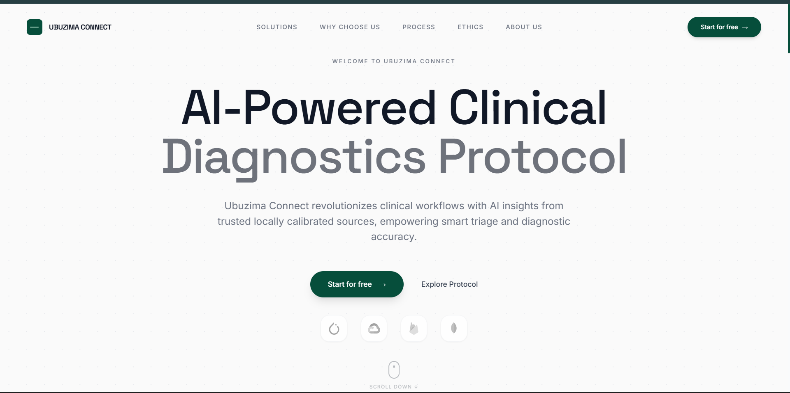

### Registration
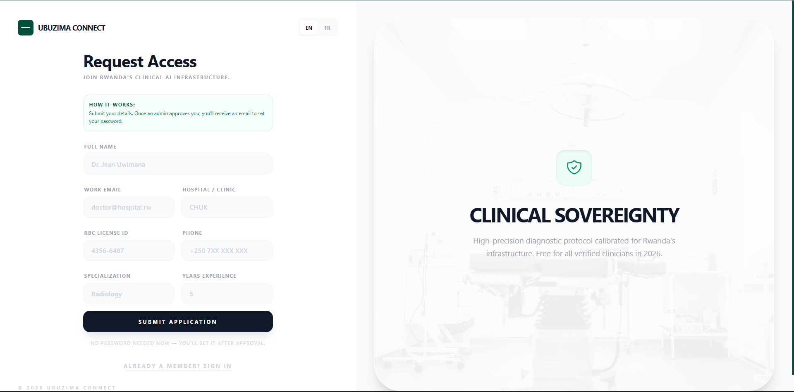

### Admin Approvals
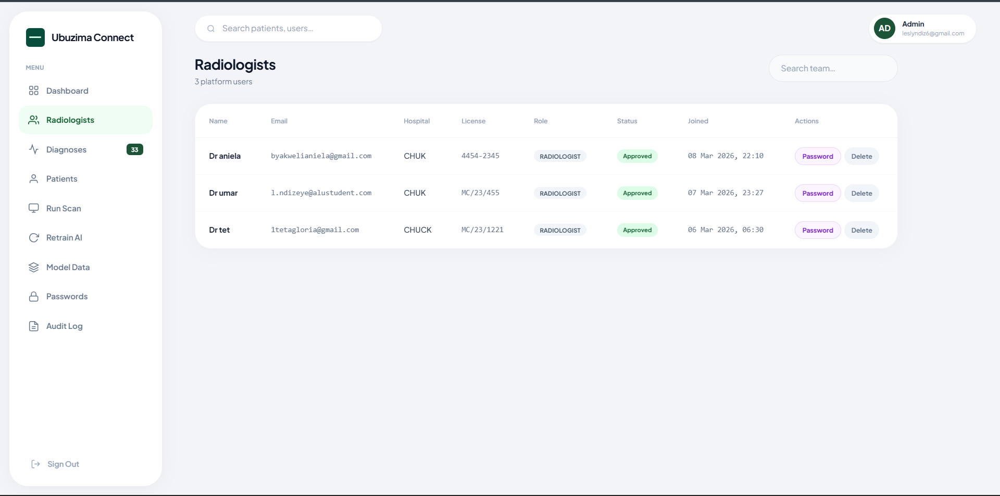

### Dashboard
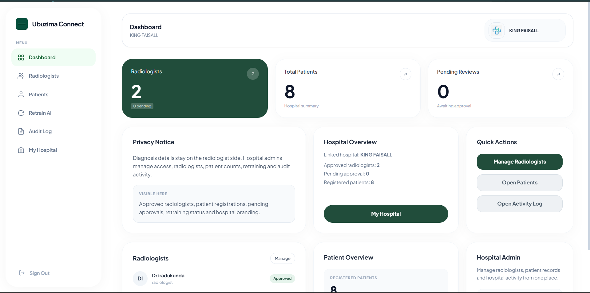

### Diagnosis Form
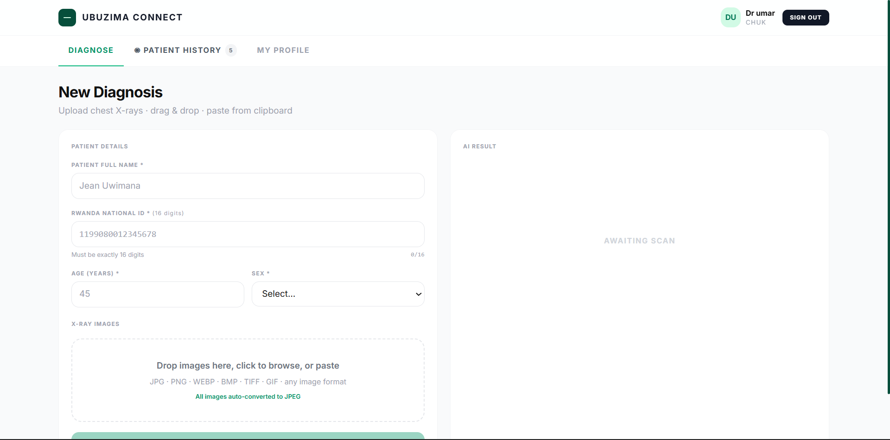

### Diagnosis Result
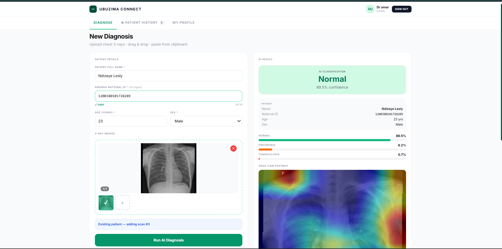

### Patient Records


### Retraining
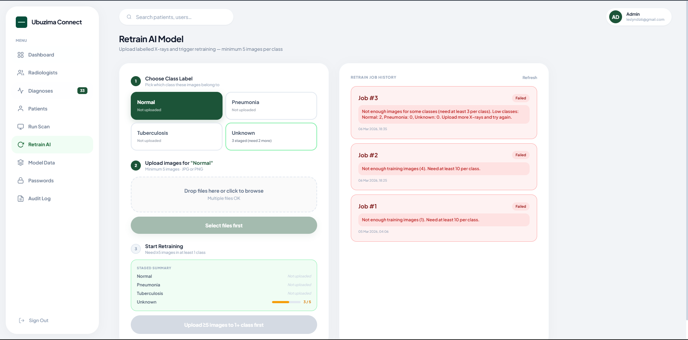

### Hospital Portal Landing Page
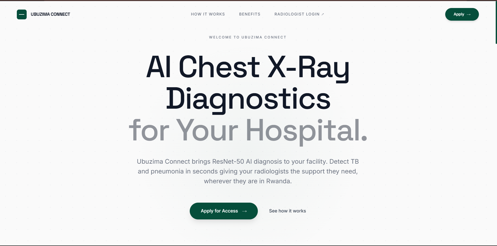

### Hospital Application Form
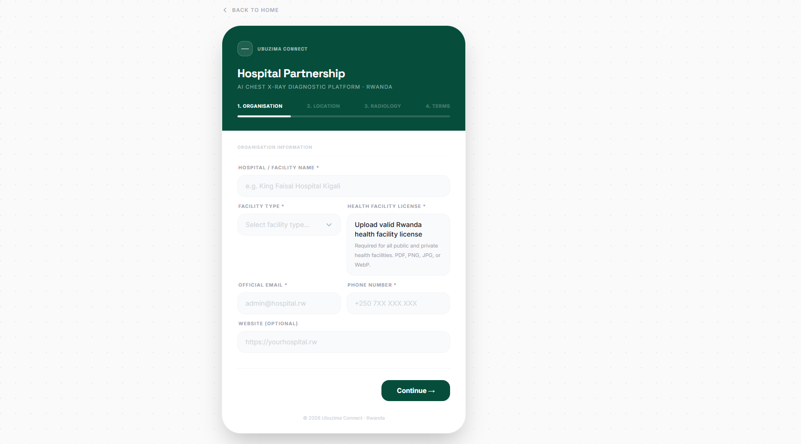


### Hospital Application Review Modal
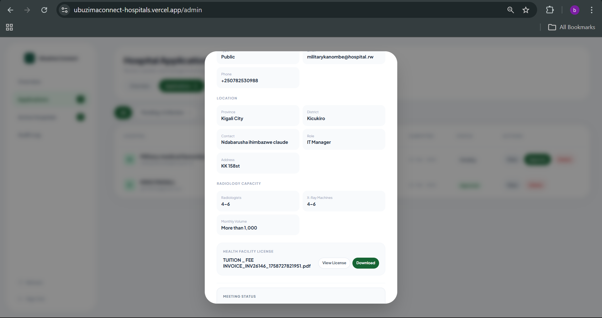

### Active Hospitals
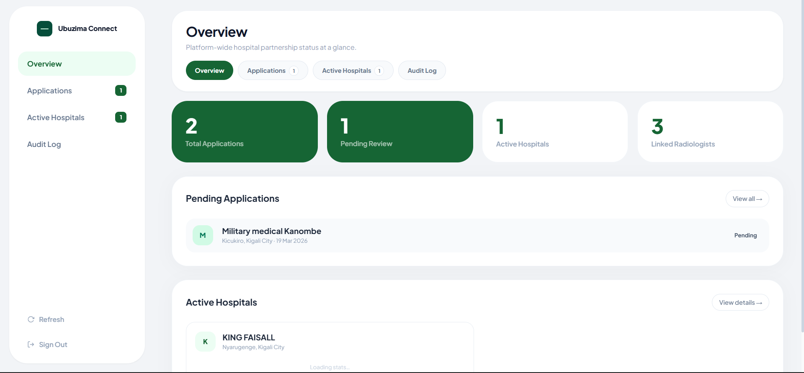


### Hospital Admin Password Management
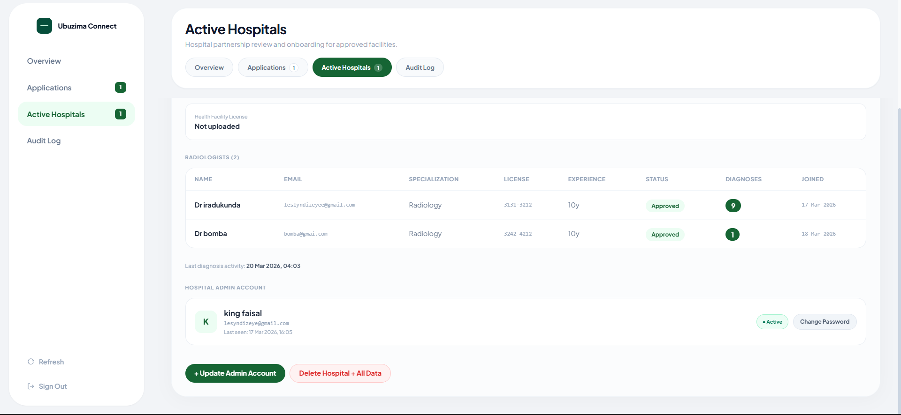


### Reports Sent & received View  
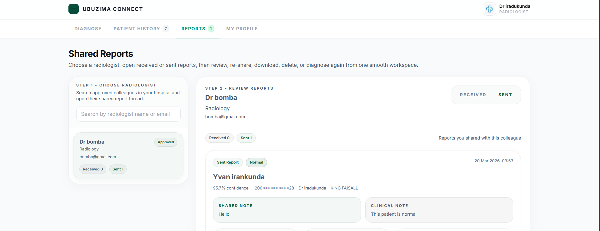

### Shared Report Detail
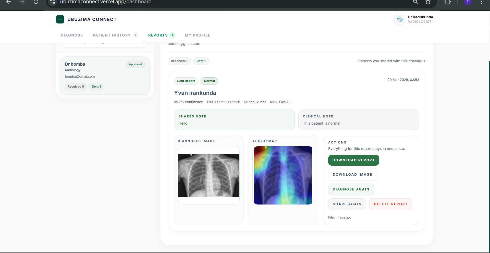

### Downloaded Report Preview
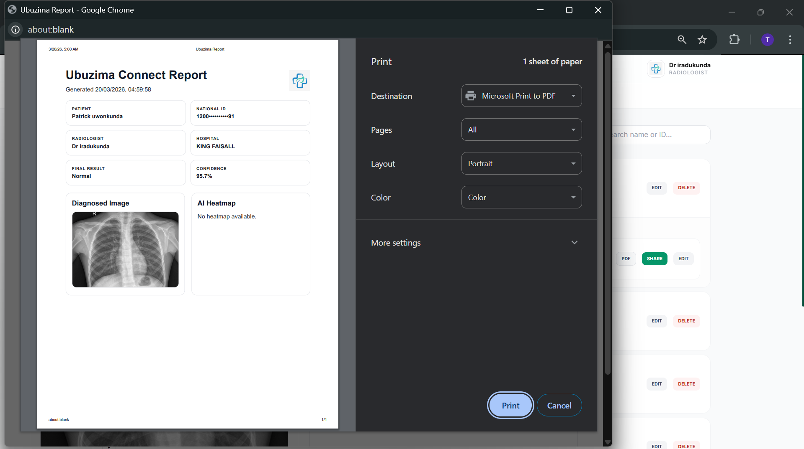

Note:
- the root README has been updated to reflect the current product
- the screenshot files should still be refreshed later with the newest hospital-portal and reports screens

## Project Structure

```text
ubuzima/
|-- backend/                 FastAPI backend, database models, auth, inference, retraining
|-- frontend/                Radiologist and platform-admin React app
|-- hospital-portal/         Hospital application portal and super-admin React app
|-- start.bat                Local helper script
`-- README.md
```

## Tech Stack

| Layer | Stack |
|---|---|
| Frontend app | React, TypeScript, Vite |
| Hospital portal | React, TypeScript, Vite, AOS |
| Backend | FastAPI, SQLAlchemy, Uvicorn |
| AI | TensorFlow / Keras, ResNet-50 |
| Database | PostgreSQL via Supabase |
| Auth | Supabase Auth |
| Frontend hosting | Vercel |
| Backend hosting | Hugging Face Spaces |

## Run Locally

### Prerequisites

- Node.js 18+
- Python 3.11
- a Supabase project

### Backend

```bash
cd backend
python -m venv venv
source venv/Scripts/activate
pip install -r requirements.txt
uvicorn main:app --reload --port 8000
```

Create `backend/.env` with values such as:

```env
DATABASE_URL=postgresql://...
SUPABASE_URL=https://<project>.supabase.co
SUPABASE_SERVICE_ROLE_KEY=<service-role-key>
SUPABASE_ANON_KEY=<anon-key>
SUPABASE_JWT_SECRET=<jwt-secret>
ALLOWED_ORIGINS=http://localhost:5173,http://localhost:3000
```

### Radiologist and Platform App

```bash
cd frontend
npm install
npm run dev
```

Create `frontend/.env`:

```env
VITE_API_URL=http://localhost:8000
VITE_SUPABASE_URL=https://<project>.supabase.co
VITE_SUPABASE_ANON_KEY=<anon-key>
```

### Hospital Portal

```bash
cd hospital-portal
npm install
npm run dev
```

Create `hospital-portal/.env.local`:

```env
VITE_API_URL=http://localhost:8000
```

## Deployment

### Backend

Hosted on Hugging Face Spaces from `backend/`.

Typical push flow:

```bash
cd backend
git push hf main
```

### Frontend

Hosted on Vercel from `frontend/`.

### Hospital Portal

Hosted on Vercel from `hospital-portal/`.

## Important Notes

- Do not store live passwords or JWT tokens in this README.
- The hospital portal is now a separate deployed app from the radiologist app.
- Health facility license upload is required for hospital applications.
- The hospital portal password reset must use the hospital-portal domain.

## API Areas

The backend currently covers:
- auth and user registration
- patients
- diagnoses
- report sharing
- hospital applications
- hospitals and hospital admin management
- retraining jobs and staged uploads
- audit logs
- model information
- health checks

Use Swagger for the full endpoint list:

`https://leslylezoo-ubuzima-backend.hf.space/docs`

## Notebook

Training notebook path:

`frontend/notebooks/Ubuzima_Connect_notebook.ipynb`

[Open in Colab](https://colab.research.google.com/github/Leslyndizeye/UbuzimaConnect/blob/main/frontend/notebooks/Ubuzima_Connect_notebook.ipynb)
